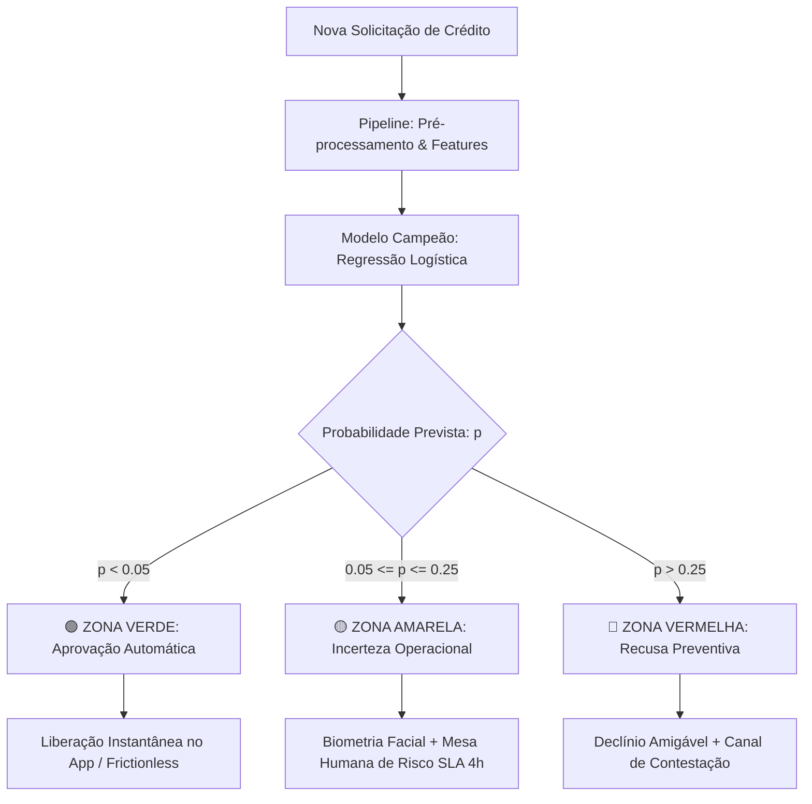

# Workshop: Matriz de Confiança 🎯
### *Avaliação Realista de Modelos, Matrizes de Custo, Calibração de Probabilidades, Políticas de Abstenção e Engenharia de Features para Crédito e Antifraude*

[](https://www.python.org/)
[](https://scikit-learn.org/)
[]()
[]()

---

## 📌 Visão Geral do Repositório

Em ambientes reais de negócios — como **concessão de crédito, detecção de fraude e saúde** —, os dados são altamente desbalanceados e os erros não têm pesos iguais. Um modelo com 92% de acurácia pode ser completamente inútil se aprovar fraudulentos (gerando prejuízos milionários) ou se travar milhares de clientes legítimos (destruindo a experiência do usuário).

Este repositório contém a jornada completa e a resolução prática do **Workshop Matriz de Confiança**. Aqui você aprenderá como sair da armadilha das métricas superficiais de Data Science e construir modelos que geram impacto financeiro real, confiabilidade probabilística e esteiras operacionais robustas.

---

## 🗺️ Trilha Pedagógica: O que Encontrar em Cada Notebook

Os notebooks foram estruturados em uma progressão didática rigorosa, partindo da teoria de erros até a implementação de um sistema de crédito de ponta a ponta:

```
┌─────────────────────────────────────────────────────────────────────────────────────────────────┐
│                                   TRILHA MATRIZ DE CONFIANÇA                                    │
└─────────────────────────────────────────────────────────────────────────────────────────────────┘
  [00_setup] ────────► [01_confusao] ────────► [02_custo_limiar] ────────► [03_calibracao]
  Ambiente &            A Ilusão da Acurácia,   Otimização de Limiar      Probabilidades Reais,
  Dependências          Tipos de Erro & Viés    pelo Custo Financeiro     Curva Confiabilidade & ECE
                                                                                   │
                                                                                   ▼
  [05_meu_modelo] ◄─────────────────────────────────────────────────────── [04_incerteza]
  O Desafio Prático do Squad:                                              Distância ao Limiar,
  Engenharia de Features, Benchmark LR vs RF,                              Curva Risco-Cobertura &
  Esteira de 3 Zonas e Relatório de Governança                             Políticas de Abstenção
```

---

### 1. [`00_setup.ipynb`](00_setup.ipynb) — *Ambiente e Verificação de Dependências*
- **Objetivo:** Garantir a reprodutibilidade técnica do ambiente antes do início dos experimentos.
- **O que você encontra:**
  - Verificação de versões do `Python`, `numpy`, `matplotlib` e `scikit-learn`.
  - Checagem do `FrozenEstimator` (introduzido no scikit-learn 1.6), fundamental para congelar estimadores durante processos avançados de calibração e empilhamento.

---

### 2. [`01_confusao.ipynb`](01_confusao.ipynb) — *Matriz de Confusão & A Armadilha da Acurácia*
- **Pergunta norteadora:** *Que tipo de erro o modelo comete e quem ele prejudica?*
- **O que você encontra:**
  - **O Modelo Burro (Baseline Maioritário):** Demonstração prática de como prever sempre a classe majoritária entrega 99% de acurácia com 0% de utilidade.
  - **Anatomia dos Erros:** Decomposição em Falsos Positivos (atrito operacional com clientes idôneos) e Falsos Negativos (fraudes não detectadas).
  - **Métricas Robustas:** Comparativo entre Acurácia, *Balanced Accuracy*, *Precision*, *Recall*, *F1-Score* e *Matthews Correlation Coefficient (MCC)*.
  - **Fatiamento por Subgrupos (Fairness & Viés Oculto):** Por que métricas agregadas escondem desempenhos inaceitáveis em recortes demográficos ou geográficos específicos.

---

### 3. [`02_custo_limiar.ipynb`](02_custo_limiar.ipynb) — *Matriz de Custo & Otimização de Limiar Operacional*
- **Pergunta norteadora:** *Por que o limiar padrão de 0,5 destrói valor no mundo corporativo?*
- **O que você encontra:**
  - **Modelagem de Custo Assimétrico:** Formalização matemática da função de perda de negócio:
    $$\text{Custo Total} = (C_{FN} \times FN) + (C_{FP} \times FP)$$
  - **Varredura Empírica de Limiar:** Teste de múltiplos *thresholds* ($t \in [0, 1]$) para encontrar o ponto ótimo de operação ($t^*$).
  - **Curvas ROC vs. Precision-Recall:** Por que a curva ROC é excessivamente otimista sob forte desbalanceamento e como a curva PR revela o real custo da precisão.

---

### 4. [`03_calibracao.ipynb`](03_calibracao.ipynb) — *Calibração de Probabilidades & Diagramas de Confiabilidade*
- **Pergunta norteadora:** *Quando o modelo diz que o risco é de 70%, o evento ocorre em 70% das vezes?*
- **O que você encontra:**
  - **Diagrama de Confiabilidade (*Reliability Diagram*):** Visualização do alinhamento entre probabilidades previstas e frações empíricas observadas.
  - **Métricas de Calibração:** Cálculo do *Expected Calibration Error* (ECE) e *Brier Score*.
  - **Técnicas de Pós-Processamento:** Comparação entre *Platt Scaling* (Sigmoide) e *Calibração Isotônica* (Isotonic Regression).
  - **A Regra de Ouro de Calibração:** Demonstração do porquê **nunca se deve calibrar no conjunto de teste** (necessidade de um conjunto de validação independente `X_val`).

---

### 5. [`04_incerteza.ipynb`](04_incerteza.ipynb) — *Incerteza Epistêmica & Políticas de Abstenção*
- **Pergunta norteadora:** *Quando o modelo deve admitir que não tem certeza e chamar um humano?*
- **O que você encontra:**
  - **Métrica de Confiança Operacional:** Quantificação da certeza como a distância da probabilidade prevista ao limiar ótimo: $|p - t^*|$.
  - **Curva Risco-Cobertura:** Avaliação do ganho de precisão e redução de custo financeiro à medida que permitimos ao modelo se abster de predições ambíguas.
  - **Arquitetura de Esteira Híbrida:** Formulação da política de envio de casos para inspeção manual (Mesa de Fraude/Crédito).

---

### 6. [`05_meu_modelo.ipynb`](05_meu_modelo.ipynb) — *O Desafio do Squad (Exercício Completo Resolvido)*
- **Pergunta norteadora:** *Como aplicar todos os conceitos em uma esteira de crédito real de alta volumetria?*
- **O que você encontra (Pipeline Completo):**
  1. Carregamento e split estratificado triplo (`X_tr2`, `X_val`, `X_te`) do `dataset_desafio_credito.csv` (18.000 registros).
  2. Demonstração do colapso do limiar padrão de 0,5 (custo de R$ 732.000).
  3. Engenharia de Features de Crédito e Risco (11 novas variáveis: DTI da operação, alavancagem, estresse de atrasos, etc.).
  4. Benchmark exaustivo entre **Regressão Logística** e **Random Forest** (com e sem calibração isotônica).
  5. Análise de disparidade geográfica (performance na Região Norte vs. Nacional).
  6. Desenho arquitetural da **Esteira de Decisão em 3 Zonas** (Verde, Amarela e Vermelha).

---

## 📊 Panorama Geral do Exercício Resolvido (`dataset_desafio_credito.csv`)

### 1. O Desafio de Negócio
- **Base de Dados:** 18.000 solicitações de crédito (`dataset_desafio_credito.csv`).
- **Prevalência Positiva (Default / Fraude):** 7,72% da base (desbalanceamento severo).
- **Assimetria de Custos:**
  - **Falso Negativo ($FN$):** Aprovar um cliente fraudador/inadimplente gera perda direta líquida de **R$ 2.000,00**.
  - **Falso Positivo ($FP$):** Bloquear ou encaminhar indevidamente um cliente bom gera um atrito de **R$ 100,00** (custos operacionais de atendimento, biometria facial e perda de margem de relacionamento).
  - **Razão de Custos:** $20 : 1$. Deixar 1 fraude passar custa o mesmo que incomodar 20 clientes idôneos.

---

### 2. Tabela Comparativa de Benchmark Consolidada

Avaliamos nos mesmos splits estratificados os dois modelos principais com e sem Engenharia de Features:

| Modelo | Limiar Ótimo ($t^*$) | Custo Total em $t^*$ | VP (Fraudes Pegas) | FN (Perdidas) | FP (Atrito) | Recall | Precisão | Balanced Acc | MCC | AUC-ROC | ECE |
| :--- | :---: | :---: | :---: | :---: | :---: | :---: | :---: | :---: | :---: | :---: | :---: |
| **Regressão Logística (Base)** | 0,0410 | R$ 338.700 | 370 | 47 | 2.447 | 88,7% | 13,1% | 69,8% | 0,2117 | **0,7972** | **0,0052** |
| **Regressão Logística (+ Features)** 🏆 | **0,0560** | **R$ 336.600** | 344 | 73 | **1.906** | 82,5% | **15,3%** | **72,1%** | **0,2396** | 0,7952 | 0,0066 |
| **Random Forest (+ Feat Bruta)** | 0,0360 | R$ 391.000 | 363 | 54 | 2.830 | 87,1% | 11,4% | 65,1% | 0,1643 | 0,7619 | 0,0132 |
| **Random Forest (+ Feat Calibrada)** | 0,0310 | R$ 394.200 | 334 | 83 | 2.282 | 80,1% | 12,8% | 67,2% | 0,1832 | 0,7597 | 0,0080 |

---

### 3. Principais Insights & Storytelling dos Resultados

#### A) O Triunfo da Engenharia de Features de Domínio
A introdução de variáveis financeiras de razão (*Debt-to-Income* da operação, comprometimento de salários, razão score/idade e interação de baixa solvência) transformou o comportamento do modelo:
- **Redução Massiva de Falsos Positivos:** Na Regressão Logística, **eliminou 541 falsos positivos** (caindo de 2.447 para 1.906 no conjunto de teste).
- **Aumento de Eficiência Operacional:** A precisão subiu de **13,1% para 15,3%**, a *Balanced Accuracy* atingiu **72,1%** e o custo total caiu para a mínima histórica do projeto: **R$ 336.600,00**.

#### B) Por que a Regressão Logística Venceu a Random Forest?
1. **Espaço Logit Natural:** O risco de crédito bancário responde a combinações log-aditivas de score e solvência. A regressão logística mapeia diretamente essas relações sem criar fronteiras em degraus artificiais.
2. **Calibração Suave:** A perda log-loss da regressão logística produz probabilidades com excelente calibração contínua nativa (**ECE de 0,0052**). Já as árvores de decisão particionam o espaço em folhas que geram probabilidades discretizadas (passos de $1/200 = 0,005$), causando acúmulo de instâncias e empates artificiais no limiar sensível de corte ($0,03 \sim 0,05$).
3. **Conformidade Regulatória (Bacen / CMN):** Em crédito, a explicabilidade é obrigatória. A Regressão Logística permite emitir *reason codes* precisos (ex: "proposta recusada porque o DTI superou 40%"), enquanto a Random Forest exige aproximações como SHAP, mais complexas de auditar perante reguladores.

---

### 4. A Arquitetura de Produção: Esteira de Decisão em 3 Zonas

Para implementar uma governança realista que respeite as limitações estatísticas e a capacidade da operação de crédito, desenhamos a seguinte esteira:



- 🟢 **Zona Verde ($p < 0,05$):** ~60% do volume. Aprovação automática, sem fricção, experiência digital 100% fluida.
- 🟡 **Zona Amarela / Incerteza ($0,05 \le p \le 0,25$):** ~35% do volume. Zona de abstenção do modelo. Solicita biometria facial, comprovante de renda complementar e direciona para a Mesa Humana de Risco.
- 🔴 **Zona Vermelha ($p > 0,25$):** ~5% do volume. Risco severo. Recusa preventiva com comunicação empática e orientação para agências físicas ou garantias reais.

---

## 📑 Relatório de Confiança e Governança

Todas as decisões, métricas detalhadas, justificativas de conformidade e storytelling executivo estão documentados no:
- 📄 [`relatorio-de-confianca.md`](relatorio-de-confianca.md) (com os 9 entregáveis do workshop e 3 anexos técnicos de governança).
- 📄 [`template_relatorio-de-confianca.md`](template_relatorio-de-confianca.md) (cópia estruturada do template original).

---

## 🚀 Como Executar Localmente

### 1. Clonar o Repositório
```bash
git clone https://github.com/thiago-cg/Workshop_Matriz_de_Confianca.git
cd Workshop_Matriz_de_Confianca
```

### 2. Criar e Ativar o Ambiente Virtual
```bash
# Criar ambiente virtual
python -m venv venv

# Ativar no Windows (PowerShell)
.\venv\Scripts\Activate.ps1

# Ativar no Linux / macOS
source venv/bin/activate
```

### 3. Instalar Dependências
```bash
pip install -r requirements.txt
# Ou instalar diretamente:
pip install -U scikit-learn numpy pandas matplotlib jupyter
```

### 4. Iniciar o Jupyter Notebook
```bash
jupyter notebook
```
> **Dica:** Comece executando o [`00_setup.ipynb`](00_setup.ipynb) para validar o ambiente e em seguida explore a trilha sequencialmente até o [`05_meu_modelo.ipynb`](05_meu_modelo.ipynb).

---

## 🛠️ Tecnologias & Ferramentas

- **Linguagem:** Python 3.12+
- **Machine Learning:** `scikit-learn` (Pipelines, ColumnTransformer, LogisticRegression, RandomForestClassifier, CalibratedClassifierCV)
- **Manipulação & Análise de Dados:** `pandas`, `numpy`
- **Visualização de Dados:** `matplotlib`
- **Metodologia:** Matriz de Confusão, Curvas ROC/PR, Expected Calibration Error (ECE), Diagramas de Confiabilidade, Abstenção por Distância ao Limiar.

---

## 📄 Licença e Créditos

Este repositório faz parte do material de formação do **Workshop Matriz de Confiança**. Desenvolvido com foco em excelência técnica, rigor estatístico e aplicabilidade ao mercado financeiro.
